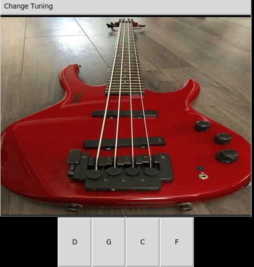

# Bass Guitar Tuner #
A simple bass guitar tuner capable of 5 different tuning modes (Drop C, Drop D, Full-Step, Full-Step (Drop C), and Standard.

# How do I use it? #
Navigate to Bass-Guitar-Tuner/src/ and execute 'python3.6 TunerGUI.py'
To change tuning, click on the Menu button 'Change tuning' and select whatever mode you want. The GUI will automatically update the buttons and sounds.

Dependencies: tkinter, playsound, Pillow

